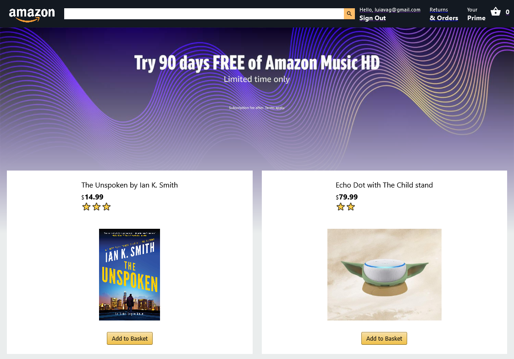

  <a href="https://amz-react-clone.web.app/">
    
    <h1 align="center">React Amazon Clone</h1>
  </a>

    E-commerce app built with <a href="https://nextjs.org/" target="_blank">Create React App</a>, Firebase Firestore, Functions & Auth, Stripe Elements and deployed with <a href="https://firebase.google.com/" target="_blank">Firebase Hosting</a>

    

## Main Features

- Responsive UI
- Material Icons
- Custom CSS
- Uses `react-router-dom` for page routing
- Uses `react redux context` for state management
- Product data pulled from `Firestore`
- User Auth implemented with `Firebase Auth` (Email & Password)
- Integrated with `Stripe Elements`
- Pages: Home, Log In, Basket, Checkout, Orders
- Add/Remove items from the basket
- User Order History

## Challenges

- Font-end setup with create-react-app
- Back-end setup with firebase firestore & hosting
- React State redux-context-provider
- Firebase auth subscription observer
- Firebase database subscription observer
- Firebase cloud functions deployment
- Page routing
- Stripe elements checkout back-end payment intents
